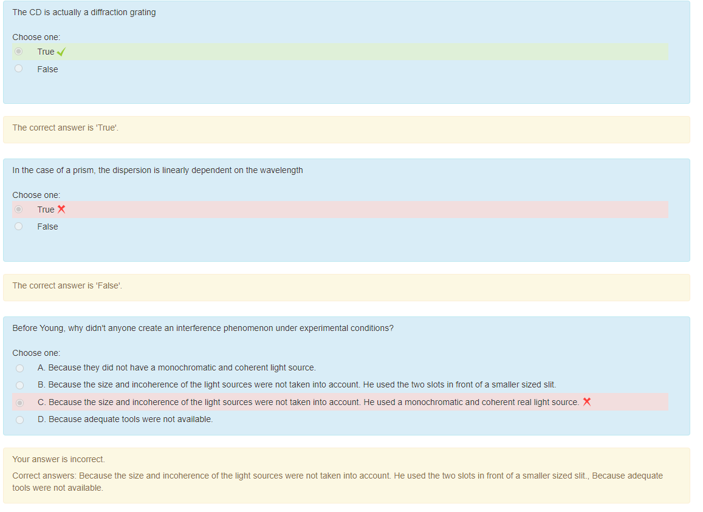

# Pay-mart app

# AWS EventBridge Rule Deployment with AFT Global Customization

This repository contains Terraform configurations to deploy an **EventBridge Rule** across all workload accounts in an AWS Organization using **AWS Control Tower Account Factory for Terraform (AFT)** and GitHub as the source control system.

---

## **Objective**

- Automatically apply an EventBridge rule to all AWS workload accounts for detecting **EC2 instance terminations**.
- Forward termination events to a central event bus in the **management account** for further processing.

---

## **Architecture**

### **Overview**
The setup ensures:
1. **Detection of EC2 Termination Events**:  
   Each workload account has an EventBridge rule to capture EC2 termination events.
2. **Cross-Account Event Routing**:  
   Termination events are forwarded to the central event bus in the management account.
3. **Centralized Processing**:  
   The management account processes events, enabling downstream workflows such as Active Directory (AD) entry deletion.

### **Architecture Diagram**

This is a diagram of the architecture

